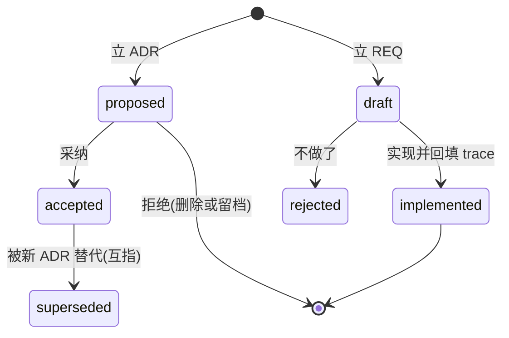

# doc-gov - evo-adr 文档即代码治理知识

**渐进知识库型 skill**:本文件只做两件事,**意图路由**(你要做的事 到 该查哪篇参考)与**体系速览**(一层概览);完整知识在 `references/` 分类扁平目录(前缀 base/flow/exp 分组,9 篇自包含),按「rg 定位文件 + mq 提取结构」渐进检索,不要求一次读完。骨架安装与门禁工具(脚本、模板、PE 诊断)在同插件 `code-kit`;资料检索在同市场 `evo-research:research`,研究成文在 `evo-research:report`,密钥深扫在 `evo-codesec:secret-scan`,多仓飞轮在 `evo-herdr:herdr-flywheel`。

核心思想:**契约在代码,文档是投影;每层只答一个问题**。类型与导出描述形态,契约注释(`///`/docstring/TSDoc)写用法,测试锁行为,ADR 锁 why,REQ 锁需求,AGENTS.md 只当索引与合同。文档生成物勿手改、不另写第二份 API 真相;公开面漂移靠工具门禁(CI 必红),不靠自觉。过程留痕进 diary,研究档案进 research,事实断言标六态。

## 一、意图路由(按意图直达参考)

> 表未覆盖的意图:跳到「二、知识库检索」用文件名/关键字搜 references/,或查 `references/README.md` 渐进索引。

| 意图 / 你要做的事 | 参考 |
| --- | --- |
| 写或改 AGENTS(五节合同:Commands/Must/Must not/Read first/环境) | `references/base-agents-contract.md` |
| 不可逆技术选择 / 写 ADR / supersede 旧决策 | `references/base-adr.md` |
| 立需求 / REQ 状态流转 / 实现后回填 trace | `references/base-req.md` |
| API 文档怎么生成 / 投影工具链 / 公开面漂移门禁 / llms 式检索面(CLI 旗标与库投影) | `references/base-projection.md` |
| 写任何文档前(命名/标题/六态/门禁) | `references/base-writing-standards.md` |
| 发一个版本(封版/tag/资产验收) | `references/flow-release.md` |
| 写日记或研究档案 / diary 一天一篇 / SNNN 编号 / 沉淀升 ADR | `references/flow-archive.md` |
| 落地前预警 / 疑似踩了已知坑 | `references/exp-pitfalls.md` |
| 经验往哪沉淀 / 踩坑何时升格 / 二犯配什么约束 | `references/exp-sedimentation.md` |
| 新项目初始化骨架 / 旧项目迁移 / PE-01 至 PE-12 诊断 / md 禁字门禁 | 同插件 skill `evo-adr:code-kit`(脚本与模板在那边) |
| 建项目脚本工具 / 建三栈工程 / 测试分层 / 平台矩阵 | 同插件 skill `evo-adr:code-kit`(base-init、flow-testing、env-platform、tool-* 四类在那边) |
| 搜论文/Google/Medium/X/GitHub/电子书/种子下载 | 同市场 skill `evo-research:research` |
| 把研究成果写成正式报告(md/pdf/docx 三件套) | 同市场 skill `evo-research:report` |
| 扫 git/GitHub 密钥密码隐私泄露 | 同市场 skill `evo-codesec:secret-scan`(浅密钥与 md 禁字门禁在 code-kit 的 scan) |
| 多仓飞轮协作 / 派单回执 / conclusion 自取 / 端点测试支撑 | 同市场 skill `evo-herdr:herdr-flywheel`(协议唯一权威源,ADR-0009) |

## 二、知识库检索(rg 定位 + mq 提取)

设计原则:目录与文件名以 **rg 检索**为先(类别前缀 base/flow/exp + 主题词);文档结构以 **mq 提取**为先(h2=节、code=命令、表格=键值)。

```powershell
# 1 文件名:类别词或主题词直接命中(base-adr / flow-release / exp-pitfalls …)
rg --files references | rg 关键词

# 2 索引:先查渐进索引拿候选
rg -n "关键词" references\README.md

# 3 全文:结构关键字直搜(ADR/REQ/投影/六态/封版/pin/PATH…)
rg -n "关键词" references\

# 4 结构化提取:进文件后按节/代码块抽取,不整篇读
reader query references\base-adr.md ".h2"       # 节导航
reader query references\flow-release.md ".code" # 只要命令
```

检索原则:先窄后宽(文件名到索引到正文);命中多篇时以 README 场景分组定主从;进文件先 `.h2` 抽目录再定点读。

## 三、体系速览(一层概览,细节均在 references)

### 六层模型(每层只答一个问题)

| 层 | 回答 | 承载件 | 门禁 |
| --- | --- | --- | --- |
| L0 形态 | 系统长什么样 | 类型/导出/package exports | tsc、cargo check、publint |
| L1 用法 | 怎么用、何时失败 | 契约注释(`///`/docstring/TSDoc) | missing_docs、ruff D、eslint-tsdoc |
| L1' 公开面 | agent/PR 可见的 API | 生成投影(aidoc、api.md) | 投影 diff 门禁(CI 必红) |
| L2 行为 | 内部正确性、外部契约 | 测试(doctest、Vitest、pytest) | 测试全绿才合 |
| L3 任务 | 如何完成一件事 | docs/guides、examples | 示例可跑 |
| L4 动机 | 为什么选这个 | docs/adr(ADR) | 不可逆选择同 PR 先写 |
| L5 索引 | 用哪条命令、先读哪份 | AGENTS.md 五节合同 | 保持短 |
| 需求 | 要做什么、验收什么 | docs/requirements(REQ) | 立项先登记,实现回填 trace |

### 文件地图

```text
<项目根>\
  AGENTS.md        极简五节合同(Commands/Must/Must not/Read first/环境)
  CLAUDE.md        一行 @AGENTS.md 桥接
  README.md / CHANGELOG.md
  docs\
    adr\           ADR-NNNN-slug.md 决策记录 + README.md 索引表
    requirements\  REQ-NNN-slug.md 需求登记 + README.md 索引表
    guides\        任务导向操作指南
    diary\         YYYY-MM-DD-主题.md 项目日记,一天一篇
    research\      SNNN 研究档案(六态标注)
  .tools\          项目脚本工具(带 README 清单)
```

### 三栈机制对照

| | Rust | Python | TypeScript |
| --- | --- | --- | --- |
| 契约注释 | `///` | docstring | TSDoc `/** */` |
| 跑示例 | cargo test --doc | pytest --doctest-modules | Vitest(+可选 doctest 插件) |
| 人看的站 | cargo doc | MkDocs/Sphinx | TypeDoc |
| agent 投影 | cargo-aidoc | Griffe(弱)/自写 | API Extractor + api-documenter |
| 公开面漂移 | aidoc --check | 自写 JSON | *.api.md 进 Git,CI diff |

### ADR/REQ 状态机



编号接当前最大号;退役不复用。ADR 正文三段 Context/Decision/Consequences;REQ 正文 Scenario/Criteria。

### 六态事实标记

`[实证: ...]`(已验证,附依据)/ `[推断: ...]`(逻辑推出)/ `[经验: ...]`(历史惯例)/ `[记忆: ...]`(建议复核)/ `[假设: ...]`(待验证)/ `[直觉: ...]`(无据倾向)。关键结论必标;禁止把「没验证」写成「已验证」。悬空中转态收尾必处置(升实证、留 research 或注销)。

## 四、参考知识库索引

完整渐进索引(快速路由到场景到全量)见 `references/README.md`。骨架安装、门禁诊断与三栈工程合同在同插件 `code-kit`(其 verification/ 持骨架规范检查用例);本插件安装通道:Claude Code `/plugin marketplace add raystyle/project-evo` 后装 evo-adr 插件(`/evo-adr:*` 斜杠命令与 PostToolUse 禁字挡板随插件生效);Codex `codex plugin marketplace add raystyle/project-evo`;Grok `grok plugin install evo-adr@project-evo --trust`;Kimi 无市场,拷 `skills/doc-gov/` 与 `skills/code-kit/` 至 `~/.kimi/skills`(命令与 hook 不随行)。
