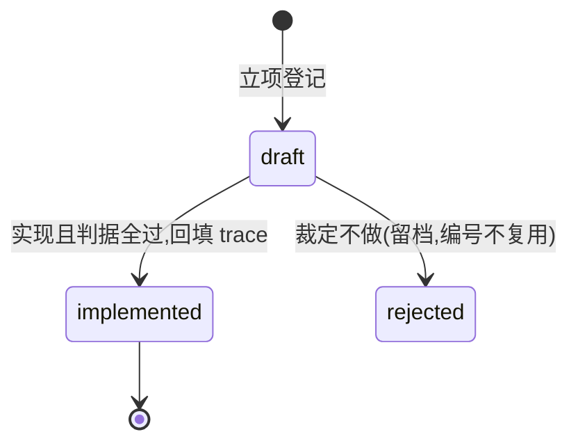

# REQ 需求登记：要做什么、验收什么、实现到哪

> 新需求先立 REQ 再实现（禁止静默假设与未登记需求直接写码）；实现后回填 trace，让「需求到测试」可追溯。REQ 管需求与验收，ADR 管 why，二者不混。

## 文件与索引

- 位置 `docs/requirements/REQ-NNN-slug.md`，编号三位接当前最大号，退役不复用
- `docs/requirements/README.md` 索引表：`| id | 状态 | 优先级 | 标题 | trace |`，每篇必登记（check.py PE-08）
- 新建拷 `0000-template.md`；状态机与 trace 由本 skill 的 check.py 校验（PE-07），不依赖外部工具

## frontmatter 契约

```yaml
---
id: REQ-002
title: 状态库 UPSERT 幂等
status: implemented     # draft 或 implemented 或 rejected
priority: must          # must 或 should 或 could
trace: tests/test_store.py::test_upsert_idempotent
---
```

- trace：测试路径或验收命令；implemented 必填（缺了被 check.py PE-07 抓住），draft/rejected 留 null
- priority 用 MoSCoW 三档；must 不满足不封版

## 正文两段

| 段 | 写什么 |
| --- | --- |
| Scenario | 谁在什么场景下要什么，一句话讲清 |
| Criteria | 可检验判据清单（可勾选）；实现后逐条勾,判据写不成可检验句 = 需求还没想清 |

## 状态机



- draft 是讨论态：Scenario/Criteria 可改；implemented 后改需求 = 新 REQ 或显式改判据（保留 trace 可追溯）
- rejected 不删档：写清拒绝原因，防止同一需求反复提出 [经验]

## 与旧体系的映射（迁移参考）

- 旧 PRD 的 D 条目 对应 REQ 条目；旧 PLAN 的步骤 对应 Criteria 勾选
- 旧 proven（成功方案归档）语义由 implemented REQ + 关联 ADR 承接，不再单独设目录
- 迁移时按「还成立的需求」迁移，已过时的直接 rejected 留档 [经验: 迁移不是搬运是重审]

## 门禁

- check.py PE-05（文件名）、PE-07（状态机与 trace）、PE-08（索引登记）
- 封版前：must 全 implemented 且 trace 可跑
