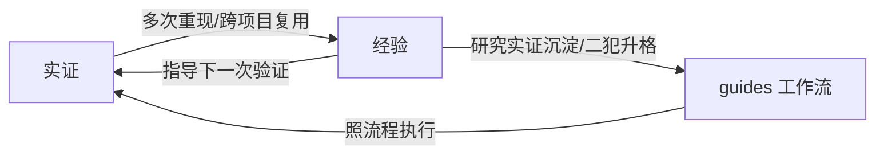

# 经验沉淀细则：成功与错误经验分治

> `[经验]` 态不是垃圾桶，落位要能被**检索路径**找到。成功经验与错误经验分治两条链，各有明确的**产生时机**（何时沉淀）与**检索路径**（怎么被找到）[经验]。

## 一、两级分类总表

| 类 | 定义 | 落位 | 检索路径 | 产生时机 |
| --- | --- | --- | --- | --- |
| **成功经验（决策取舍）** | 为什么选这个、备选为何落选 | `docs\adr\`（ADR 编号） | ADR README 索引表 | 不可逆选择拍板时 |
| **成功经验（做法流程）** | 做什么就按什么流程来的正确工作流 | `docs\guides\`（主题短词） | AGENTS Read first | ① 研究收尾 `[实证]` 后沉淀；② 同型坑二犯后抽升 |
| **错误经验** | 出错后的纠偏与处理方法 | `docs\diary\` 当场记；同根因聚合 | rg 搜 diary/ADR | **踩坑当场**（禁止收尾补） |

## 二、成功经验链

### ADR：决策与取舍沉淀

- 时机：不可逆技术选择拍板时（不是收尾时补记;事后的 ADR 丢掉真实备选语境）
- 用法：下次做同类型选择，先搜 ADR 找先例与被否掉的备选;被否选项也是资产（防止反复重提）
- 索引：docs/adr/README.md 表

### guides：实证做法与正确工作流

- **时机一（研究实证后）**：研究收尾结论经六态定级，`[实证]` 的做法沉淀进 guides,研究证明了这样做对，下次直接用
- **时机二（多次错误后）**：同型坑二犯以上，把纠偏方法**抽升成正确工作流**进 guides,从此照流程做，不需要每次踩了再查 diary
- 索引：AGENTS Read first 节一行指向
- **禁止**：`[推断]`/`[假设]` 跳级进 guides（未经实证的做法不是工作流）

### 实证与经验的循环（迭代复利）



- 实证不是终点，经验不是低档：实证多次重现固化为经验，经验让下一次实证更快更准，循环使经验库**复利增厚** [经验]
- guides 是这个循环的固化形态：时机一（研究实证沉淀）与时机二（二犯升格，即事上磨炼）都是「行返知」；照 guides 工作流执行是「知落行」

## 三、错误经验链

- **沉淀时机（强规则）**：踩坑**当场**记 diary 当天一篇（同根因聚合一节）；禁止「先留着收尾再说」
- 主题需深挖时落 research(diary 记现象级条目，research 记机理，两处互指）
- 涉及技术选择的坑（选错了/参数钉错了）升 ADR：Context 写坑的实测量级，Decision 写纠正后的选择
- **升格**：同型坑二犯以上，正确处理抽升成 guides 工作流（diary 条目保留现象与根因，指向新位置），**错误经验的终点是变成正确工作流**
- **集成约束（二犯以上必配）**：只写文档的纠偏会被再犯；同型坑二犯起，除规则与文档外必须落至少一条**机器可执行的约束**，四形态 [经验]：
  - agent hook：执行体（Claude Code 等）的 PostToolUse/PreToolUse 钩子，阻断或提醒
  - uv 脚本门禁：`.tools\` 下 uv 运行时 Python 脚本，项目强制执行检查
  - git 提交钩子：pre-commit 挡板，不过不进库
  - 回归测试用例：错误转 pytest 用例，CI 常驻
  - 规则是知，约束是行；只有文档没有约束的纠偏是知行分离，必再犯；测试门禁体系见 code-kit 的 flow-testing

## 四、两条链的边界与互转

```text
踩坑 ──当场──> diary(现象/根因/处理)
                 │ 同型坑二犯以上:处理方法升格成工作流
                 └──抽升──> guides(正确工作流)<──AGENTS Read first 索引
研究 ──收尾──> [实证] 断言 ──沉淀──> guides(实证做法)
         └── [推断]/[假设] ──留──> research(待验证,禁止跳级)
选择 ──拍板──> ADR(取舍与备选归档)
```

- **一条知识只有一个权威落位**：ADR 管决策取舍；guides 管实证做法与正确工作流；diary 管错了怎么纠（现象级）；research 管为什么/待验证
- 同一事件可两处各留一行但**内容不重复**（diary 记纠偏，guides 记工作流）

## 五、验收清单

1. 新 guides 文件有 AGENTS Read first 一行指向（能被检索到）
2. 新 diary 踩坑条目有根因与正确处理两栏（不是只记现象）
3. 研究收尾时 `[实证]` 结论在 guides 有落位（或明确说明无需沉淀的理由）
4. 同型坑二犯后 diary 条目已升格或指向 guides 工作流
5. 二犯以上的错误已配集成约束（四形态至少一条落地）
