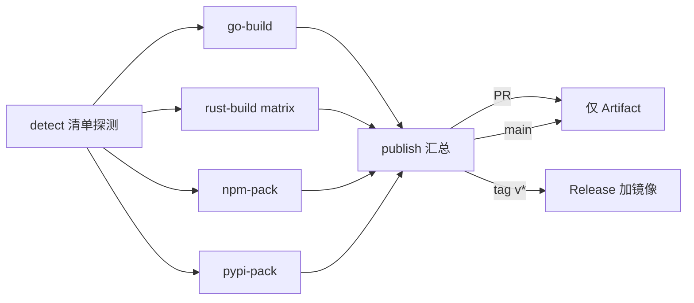

# 编译打包流水线：detect 到构建到发布到镜像

> 全仓通用 CI/CD 编译打包发布标准:detect 清单驱动、测试先行、Artifact 到 Release 到 R2 镜像。定制基底为外部 CI/CD 通稿(2026-09-17 总台裁定采守各七条,新增两条;追正补编译产地与播种分工核心条款),实证链为当日全链实录(aria2 十五轮自含构建、ark v1.3.0 与 hst v2.0.0 与 browse v0.2.0 滚版、REQ-053 闭环)。封版操作面(封版件、tag 触发、发布验收)在 flow-release,本文只管流水线形态,互引不重复。

## 一、目标与边界

**做**:detect 清单驱动,仓里有什么编什么;测试过再打包;产物逐件带校验边车;PR 只产 Artifact 供评审下载;tag 时发 Release 并镜像。

**不做**:产物零 commit 回仓;不发公共注册表(npm publish、twine upload、cargo publish 一律禁,含 Trusted Publishing);不让多个发布工具各建 Release 抢同一 tag。

**适用面**:有 CLI 资产的工具仓;纯库仓与插件仓走各栈投影与市场通道(见 base-projection 与本仓市场形态),不进 R2 段。

## 二、编译产地与播种分工(核心分工条款)

- **总台 rclone(omc 的 r2 命令面)= 仅 chrome 级大件**:chromium 类舰队编译产物 CI 不可产(体量与工具链面超出 Runner),由总台实机编译后 rclone 推 chrome 桶;这是总台手工播种面的唯一保留域
- **其余仓小件 = 本仓 GitHub Actions 全链自包**:detect 清单驱动的 CI 内编译,接测试、打包、gh release 直发、CI 内 rclone 推 ohmygh 段、发布,五环一链全在仓内流水线;**零总台手工**:总台手挂 release 或手推镜像属过渡期特例(ark v1.3.0 Draft 态代发即其尾例),标准明文禁为新形态
- **两个 rclone 分表述,勿混**:「总台 rclone」是大件手工播种面(omc r2 命令,chrome 桶);「CI 内 rclone」是小件自播正道(第四节 env 四键 Secrets 形);同名工具,产地与权限面不同

## 三、detect 清单驱动

| 清单 | 通道 | 产物 |
| --- | --- | --- |
| `go.mod` | `CGO_ENABLED=0` 交叉编译 | `name-os-arch[.exe]` |
| `Cargo.toml` | `cargo build --release --target` matrix | `name-<target>[.exe]` |
| `package.json` | `npm ci` 后 `npm pack` | `name-version.tgz` |
| `pyproject.toml` | `python -m build` | `*.whl` 加 `*.tar.gz` |

各栈注意:Go 主包在 `cmd/` 时改 build 路径;Rust 名取 Cargo.toml 或仓 Variable,aarch64-linux 需交叉 linker,musl 才纯静态;npm 用 files/exports 控 tarball,workspace 全子包加 `--workspaces`;Python 带 C 扩展换 cibuildwheel。

## 四、流水线形态

- 事件三态:PR 只 Artifact;main 走 Artifact;tag `v*` 加 Release 加镜像
- publish 准入:至少一类打包成功且无任何一类 failure;对应清单不存在则该 job 静默跳过
- 通道对比:Artifact 随 run 寿命短(约 14 天)且下载常需登录;Release 随仓长期且公开仓可匿名;R2 段自控寿命,绑域后可匿名 [实证]

| 通道 | 入口 | 寿命 | 匿名下载 |
| --- | --- | --- | --- |
| Artifact | Actions run | 短(天级) | 通常需登录 |
| GitHub Release | Releases 页 | 随仓长期 | 公开仓可以 |
| R2 段 | 自定义域 | 自控 | 绑域后可以 |

## 五、镜像推送恒 rclone(禁 aws-cli 形)

- **CI 内 rclone 自播正道**:Secrets 恒 env 形四键 `R2_ACCESS_KEY_ID`、`R2_SECRET_ACCESS_KEY`、`R2_ENDPOINT`(S3 兼容端点)、`R2_BUCKET`;Token 仅授权目标桶 Object Read & Write,不用 Global Key
- 推送形:`NO_CHECK_BUCKET=true rclone copy <产物目录> :s3:$R2_BUCKET/<tool>/<版本>/ --s3-endpoint $R2_ENDPOINT --s3-access-key-id $R2_ACCESS_KEY_ID --s3-secret-access-key $R2_SECRET_ACCESS_KEY --header-upload "x-amz-meta-immutable: true"`;版本段对象 immutable,禁覆写
- **双段制**:恒 `<tool>/<版本>/` 加 `<tool>/stable/` 两段;stable 是自更新滚动段,短缓存 `Cache-Control: max-age=60`,刷段用 `rclone sync <产物目录> :s3:$R2_BUCKET/<tool>/stable/ ... --delete-excluded`(滚代清旧);禁通稿 `releases/<tag>/` 形
- 段内逐件 `.sha256` 边车(sha256sum 原生格式 `<hash>  <文件名>`),边车即镜像锚契约,下载腿与 digest 判新都以它为准;聚合 `SHA256SUMS` 可作补充不替代 [实证: ark 与 hst 下载腿以边车锚跑通]

## 六、Release 面

- 恒 `gh release create <tag> <资产...> --latest` 直发钉回 latest,禁 draft 形;多发布工具各建 Release 是抢 tag 事故源 [实证: 2026-09-17 ark v1.3.0 Draft 态由总台代发收口,--draft=false 加 --latest;此属第二节所列过渡期特例尾例,标准禁为新形态]
- Release 资产与镜像段同源同批,发布器与升级器同 digest 判据(见 flow-release 第八节三通道与自升级,不重复)

## 七、护栏三件

1. **版本一致性闸加解包冒烟**:tag 对载体 manifest(Cargo.toml 或 package.json 或插件三清单,载体唯一权威见 flow-release 第七节)不一致 job 直接红;CI 内解包跑 `--version` 与 tag 逐字对
2. **零上传红灯**:mirror job 推完清点对象,零对象即红(防上游 draft 窗或准入误判静默 skip);确无资产的仓型用显式豁免开关,不许默认静默 [实证: ark draft 窗静默 skip 教训]
3. **dispatch 补推口**:publish/mirror 挂 `workflow_dispatch`,needs 链 `if` 套 `always()` 让补推不依赖重跑全链 [实证: aria2 发布窗补推坑]

## 八、自升级与 ark 升级对齐

- **有自升级能力的 CLI**:self update 双通道,自家 ohmygh stable 段优先,GitHub release 404 自动回落;digest 判新加 `.sha256` 边车锚校验;发布器与升级器同 digest 判据(三通道全貌见 flow-release 第八节,不重复)[实证: ark 与 hst 已各自跑通];dev 加 stable 双通道是否随仓开放由仓裁
- **无自升级面的静态件**:升级归安装管理方;小件归 ark install/update 走 catalog pin,chromium 类大件归 browse 内嵌版本管理器走 chrome 桶(产地分工见第二节)
- **对齐判据**:五端升级路径一致,ark update 或各仓 self update 终态同 digest;总台 dist fleet 与 ark 验收双面核 [实证: 2026-09-17 ark 收敛验收,五端探针三工具新 pin 全绿]

## 九、跨宿主构建闸与回执对账(实录新增)

- **跨宿主闸**:同一产物在不同构建宿主上冒烟(容器闸),防 glibc 与 openssl 互踩;ldd 静态断言双流重定向加 file 双断言 [实证: aria2 v1.37.2,OSSL legacy dlopen 拖宿主库 22.04 产物 24.04 SIGSEGV,五岗绿含 24.04 容器冒烟收口]
- **回执对账**:发布回执 digest 一律 gh api 自取,GitHub 与镜像与 catalog 三方逐字等才闭环;对方陈述不作数(协议面见 evo-herdr:herdr-flywheel) [实证: 2026-09-17 三仓滚版 digest 三方对账]

## 十、故障排查表

| 现象 | 处理 |
| --- | --- |
| go-build 找不到 main | 改 build 路径 `./cmd/<bin>` |
| Rust 名不对或链接失败 | 核 Cargo.toml name 或 Variable;aarch64 装 gcc-aarch64-linux-gnu 并设 linker |
| npm pack 文件不全 | 核 package.json 的 files/exports 与 .npmignore |
| python -m build 失败 | 补 pyproject.toml 的 build-system |
| publish 被 skip | PR 故意跳;四类全 skip = 仓无清单;镜像零对象红灯看第七节 |
| R2 AccessDenied | Token 权限面、桶名、endpoint 匹配;禁 Global Key |
| Release 没文件或没置 latest | 核推的是 v* tag;gh CLI 加 --latest 直发,勿 draft(第六节) |
| 升级态漂移 | 第八节对齐判据:五端终态同 digest,总台与 ark 双面核 |
| 产物异宿主崩溃 | 第九节跨宿主容器闸;ldd 双流断言 |

## 十一、安全清单

- R2 Token 仅目标桶 Object Read & Write,定期轮换
- Secret 只在 GitHub Secrets,文档与 YAML 只留占位
- 产物不进源码库;公开仓 Release 资产视为公开,敏感工具走私有仓加私有桶
- 下载侧核对 `.sha256` 边车;镜像锚以边车为唯一契约

## 十二、与体系其它件的衔接

| 环节 | 依据 |
| --- | --- |
| 封版件与 tag 触发、发布验收 | flow-release 第三至六节 |
| 多仓版本标准(载体唯一权威、semver 判据) | flow-release 第七节 |
| 分发体系三面(种子、镜像路由、自升级) | flow-release 第八节 |
| 平台矩阵与实机接管 | code-kit 的 env-platform 六/七节 |
| npm 包资产双处 version 与安装验收 | code-kit 的 tool-typescript 第十节 |
| 回执协议与 conclusion 自取 | 同市场 skill evo-herdr:herdr-flywheel |
