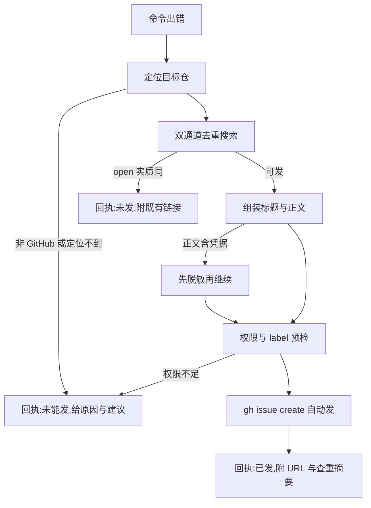

# gh-issue - 命令出错自动上报 GitHub issue

> 本机命令/工具报错要上报上游时走本 skill。两条用户裁定(2026-09-16):**无草稿确认闸**,组装完直接 `gh issue create` 自动发;**发前必去重**,命中 open 重复则不发、回执附既有链接。唯一停点是信息缺失(仓定位不到、报错原文不可得、fork 归属存疑),不是人工确认。通用 gh 搜索与 release 面在同市场 evo-research:research 的 gh 篇,本 skill 只管 issue 上报纪律,单向指路不反向依赖。

## 一、意图路由

| 你要做的事 | 入口 |
| --- | --- |
| 确定发给哪个仓(remote 解析、fork 与 upstream、非 GitHub 判定) | `references/gh-ops.md` 第一节 |
| 查重并判定发不发(双通道与四格矩阵) | `references/gh-ops.md` 第二节 |
| 组装标题与正文、截断与脱敏 | `references/issue-body.md` |
| label 预检、权限预检、发单细则与坑表 | `references/gh-ops.md` 第三至五节 |
| 整条流程从头走一遍 | 本文件第二节 |

## 二、工作流五步



1. **定位目标仓**:报错命令在 git 仓内跑,`git remote get-url origin` 自取(无 origin 取首个 remote;SSH 与 HTTPS 形态都解析,剥 `.git` 尾),再 `gh repo view` 核对 nameWithOwner;不在仓内或工具另有仓,显式给 `--repo owner/repo` 或问用户。fork 默认发 upstream,疑在 fork 引入时问用户。**禁硬编码工具到仓的映射表**(漂移面)。解析序细则见 `references/gh-ops.md` 第一节。
2. **双通道去重**:`gh search issues`(全局索引)加 `gh issue list --search`(仓内实时),发前复跑一次仓内通道兜底索引延迟。搜索词取报错首行错误码、异常名、工具子命令,两三个词。判定矩阵:open 实质同 = 不发附链;closed 且当前版本复现 = 发但正文附旧单;命中但症状不同 = 发并列相关;双空 = 发。细则见 `references/gh-ops.md` 第二节。
3. **组装**:标题公式 `<工具名> <版本>:<症状一句话>`,错误码与异常名保原文;正文六段(背景与环境、最小复现、实际输出引块、期望行为、版本事实、相关单)按 `references/issue-body.md` 模板;超长报错先剥 ANSI 色码再截断(保首尾各 20 行,中段标注截断行数);正文含 token、密钥、内网主机名、家目录路径即止,先换占位(口径对齐 evo-codesec:secret-scan)。
4. **发单**:`gh repo view --json viewerPermission` 预检,write 以上才发;`gh label list` 预检命中才带 `--label bug`,他人仓不擅自建 label;`--title` 与 `--body-file` 必显式(无头环境缺标志会弹编辑器挂起);body 落临时文件,发完清理。
5. **回执三态**:已发(issue URL 加查重摘要:搜了什么词、几条命中、为何判非重复);命中 open 未发(既有链接加判定对照);未能发(原因加建议动作)。模板见 `references/issue-body.md`。

## 三、命令面(本节命令本会话实证可跑)

```bash
git remote get-url origin                              # 仓解析第一步(本仓实测 HTTPS 形态)
gh repo view --json nameWithOwner,viewerPermission     # 仓核对与权限预检(本仓实测 ADMIN)
gh search issues "<错误码或症状词>" --repo <owner>/<repo> --state open --json number,title,url --limit 10
gh issue list --repo <owner>/<repo> --state all --search "<错误码或症状词>" --json number,title,url --limit 10
gh label list --repo <owner>/<repo> --json name --jq ".[].name"
gh issue create --repo <owner>/<repo> --title "<工具名> <版本>:<症状一句话>" --body-file <正文文件> --label bug
gh issue view <N> --repo <owner>/<repo> --json url,state,title
gh issue close <N> --repo <owner>/<repo> --comment "实证完成,验后关闭"
gh auth status                                          # 认证面预检
```

[实证: 2026-09-16 本仓 raystyle/project-evo 实跑;create 与 close 以自发实证单走通,验后即关] label 未预检命中时去掉 `--label` 重发;`gh issue close` 仅自证与自纠场景。

## 四、硬规则

- 发单前必双通道去重,open 命中一票否决
- 报错原文不改写不翻译,截断必标注
- 正文含凭据即止,先脱敏
- 他人仓:不擅自建 label、不 comment、不 assign
- `--title` 与 `--body-file` 必显式,禁交互形态

## 五、参考索引

- `references/README.md`:两篇渐进索引(gh-ops 命令细则、issue-body 模板与回执)
