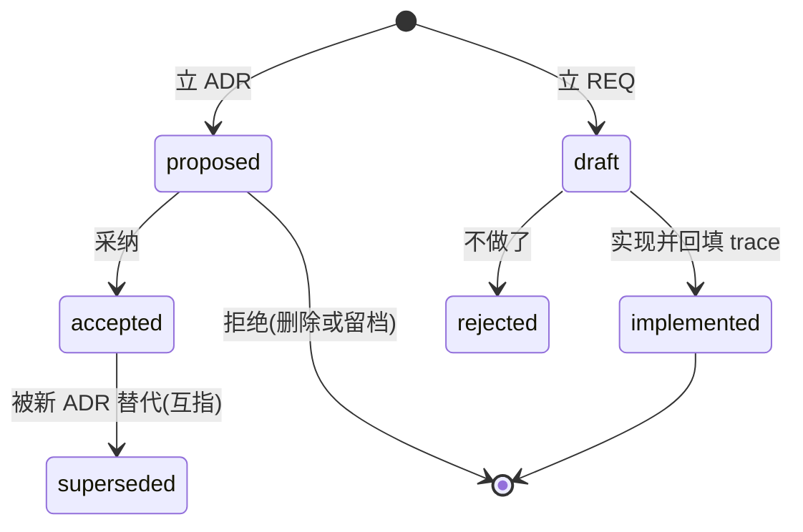

# doc-gov - evo-doc 文档框架治理知识

**渐进知识库型 skill**:本文件只做意图路由与形态速览;完整知识在 `references/` 分类扁平目录(前缀 base/tool 分组,5 篇自包含),按「rg 定位文件 + 结构化提取」渐进检索,不要求一次读完。

核心思想:**需求决策走 ADR/REQ(动机与验收留痕),公开契约就近进代码注释,对外文档面一律是投影(单一权威源,可再生成)**。课题证据走研究档案(信源、对照与六态结论);工程骨架走项目工具链范式(归档、直跑、门禁、发布)。事实断言标六态,禁止把「没验证」写成「已验证」。

## 一、意图路由(按意图直达参考)

> 表未覆盖的意图:用文件名/关键字直搜 references/,或查 `references/README.md` 索引。

| 意图 / 你要做的事 | 参考 |
| --- | --- |
| 不可逆技术选择 / 写 ADR / supersede 旧决策 | `references/base-adr.md` |
| 立需求 / REQ 状态流转 / 实现后回填 trace | `references/base-req.md` |
| 写代码 doc 注释 / 契约注释 / 文档即代码 / 投影守卫 | `references/base-code-doc.md` |
| 立研究档案 / S 编号一题一篇 / 对照分流与六态结论 | `references/base-research.md` |
| 建项目工具链 / uv 与 PEP 723 形态 / 门禁挂接与发布面 | `references/tool-project-kit.md` |
| 三层聚合与技能自进化 / 轨迹总结 / 模式页 / 标准 skill / 归档统一字母表与本面工件归层 | 同市场技能 `evo-skills:distil-skill`(唯一权威源) |
| Agent 原生友好开发 / --llms 手册 / CTA 协议 / 自省 | 同插件 skill `evo-doc:native-design` |
| 多仓飞轮协作 / 派单回执 | 同市场技能 `evo-herdr:herdr-flywheel` |

## 二、知识库检索(rg 定位 + 结构提取)

设计原则:目录与文件名以 **rg 检索**为先(类别前缀 base/tool 加主题词);文档结构以**结构化提取**为先(h2 节、code 命令、表格键值)。

```powershell
rg --files references | rg 关键词          # 文件名直达
rg -n "关键词" references/README.md        # 索引定位
rg -n "关键词" references/                 # 全文直搜
```

检索原则:先窄后宽(文件名到索引到正文);进文件先抽 h2 目录再定点读。

## 三、形态速览(一层概览,细节均在 references)

### ADR/REQ 状态机



编号接当前最大号;退役不复用。ADR 正文三段 Context/Decision/Consequences;REQ 正文 Scenario/Criteria;各自 README 索引表必登记。三层聚合仓中:ADR/REQ 即 knowledge 层页型(knowledge/adr、knowledge/req),ADR 保持 Nygard 三段,不换 MADR 全模板(归档字母表见 distil-skill layers)。

### 代码 doc 注释与文档即代码

公开项注释即契约,改公开项同步注释与测试同提交;what 进注释,why 进 ADR。单一权威源:README、手册、--llms 面皆投影,可再生成不手改,漂移守卫进门禁,发现第二份真相即删或降指针。

### 研究档案(纯项目记录)

`SNNN-主题.md` 一题一篇,文件名即标题,编号退役不复用;篇首引块记信源与快照、关联编号、用户裁定;正文分背景、过程、结果、关键结论(逐条六态)、参考,对照类加对照分流(等价不吸收、真新增吸收、留档)。三层聚合仓中:结论页在 knowledge/research,信源原档留 sources/external,编号跨层贯通;纯 doc-gov 仓形态不变(形态跟项目形态走)。

### 项目工具链范式

工具归档目录加清单、PEP 723 零依赖 uv 直跑、门禁三态退出码加提交挡板、发布三段式加哈希边车;细则见 `references/tool-project-kit.md`。
