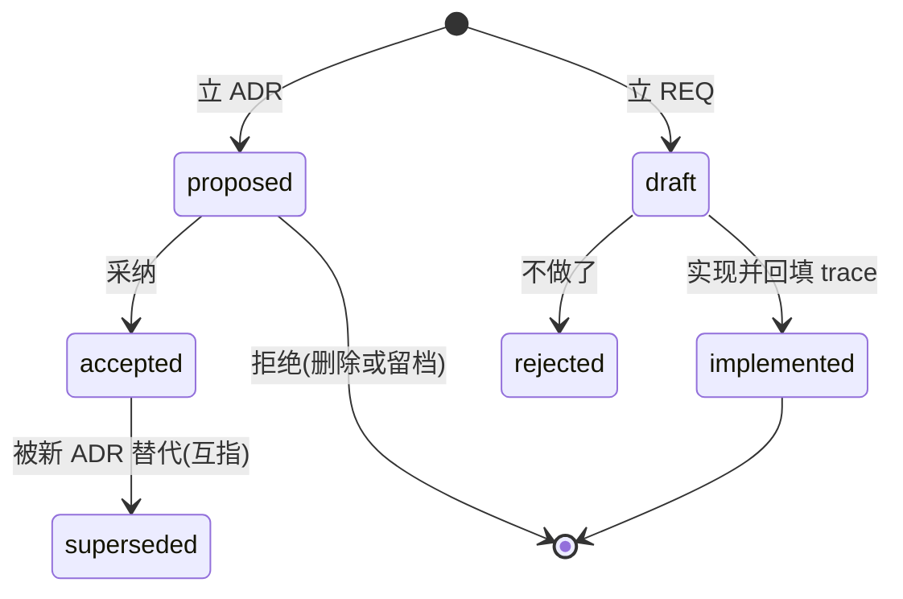

# doc-gov - evo-doc 文档框架治理知识

**渐进知识库型 skill**:本文件只做两件事,**意图路由**(你要做的事 到 该查哪篇参考)与**形态速览**(一层概览);完整知识在 `references/` 分类扁平目录(前缀 base/tool 分组,7 篇自包含),按「rg 定位文件 + mq 提取结构」渐进检索,不要求一次读完。多仓飞轮在 `evo-herdr:herdr-flywheel`。

核心思想:**文档形态跟项目形态走,每层只答一个问题**。需求决策走 ADR/REQ(动机与验收留痕);过程轨迹走项目日记(当日裁定与坑);知识资产走 COE 三层(依据、结论、手册单向支撑加双链图);对外 CLI 走 Agent 友好架构标准(agent 是第一用户)。事实断言标六态,关键结论必标,禁止把「没验证」写成「已验证」。

## 一、意图路由(按意图直达参考)

> 表未覆盖的意图:用文件名/关键字直搜 references/,或查 `references/README.md` 索引。

| 意图 / 你要做的事 | 参考 |
| --- | --- |
| 不可逆技术选择 / 写 ADR / supersede 旧决策 | `references/base-adr.md` |
| 立需求 / REQ 状态流转 / 实现后回填 trace | `references/base-req.md` |
| 写项目日记 / 一天一篇 / 裁定与坑留痕 / 择要升格 | `references/base-diary.md` |
| 建 COE 知识库 / 三层聚合 / [[双链]]与图检索 / 指挥总纲路由 | `references/base-coe.md` |
| 给 CLI 配 --llms 手册面 | `references/agent-face.md` 第一节加 `references/templates.md` 第二节 |
| 定旗标全家与信封协议(类型化 CTA) | `references/agent-face.md` 第二节加 `references/templates.md` 第三与四节 |
| 定默认帮助面节序 | `references/agent-face.md` 第三节加 `references/templates.md` 第四节 |
| 做命令自省与漂移守卫 | `references/agent-face.md` 第四节加 `references/templates.md` 第五节 |
| 定裸调用面(不弹交互,exit 恒 0) | `references/agent-face.md` 第五节加 `references/templates.md` 第三节 |
| agent CLI 发现通道与 token 经济学 / 任务脚本 workspace | `references/tool-cli-agents.md` |
| 多仓飞轮协作 / 派单回执 / 端点测试支撑 | 同市场 skill `evo-herdr:herdr-flywheel`(协议唯一权威源,ADR-0009) |

## 二、知识库检索(rg 定位 + mq 提取)

设计原则:目录与文件名以 **rg 检索**为先(类别前缀 base/tool + 主题词);文档结构以 **mq 提取**为先(h2=节、code=命令、表格=键值)。

```powershell
# 1 文件名:类别词或主题词直接命中(base-adr / base-coe / agent-face …)
rg --files references | rg 关键词

# 2 索引:先查索引拿候选
rg -n "关键词" references\README.md

# 3 全文:结构关键字直搜(ADR/REQ/双链/三层/信封/自省/裸调用…)
rg -n "关键词" references\

# 4 结构化提取:进文件后按节/代码块抽取,不整篇读
reader query references\base-adr.md ".h2"       # 节导航
reader query references\templates.md ".code"    # 只要命令与模板
```

检索原则:先窄后宽(文件名到索引到正文);命中多篇时以 README 分组定主从;进文件先 `.h2` 抽目录再定点读。

## 三、形态速览(一层概览,细节均在 references)

### ADR/REQ 状态机



编号接当前最大号;退役不复用。ADR 正文三段 Context/Decision/Consequences;REQ 正文 Scenario/Criteria;各自 README 索引表必登记。

### 项目日记(活轨迹)

一天一篇 `YYYY-MM-DD-主题.md`,篇首引块记用户令原文与当日闭环;正文分裁定、坑、门禁退出码、终态四节;过程不改写。素材池定位:不可逆决策升 ADR,需求升 REQ,持久结论升 COE knowledge。

### COE 三层与双链

sources(依据)、knowledge(结论)、operations(手册)三层单向支撑;知识页 frontmatter 登记 links,正文 `[[双链]]`;`_index/graph.json` 入边图可再生成,查询脚本双向检索。硬规则:知识页无 sources 标 unverified;手册无 knowledge 链接不得当规范;原理不进手册,步骤不进知识页,正文不进总纲。

### Agent 友好 CLI 五件

--llms 紧凑手册面(至多 120 行,附机器形)、旗标全家与类型化 CTA 输出协议、默认帮助面节序、活命令树三面同源自省(禁手维护)、裸调用面(不弹交互,exit 恒 0);发现通道选型与 token 经济学、任务脚本 workspace 见 `references/tool-cli-agents.md`,实现模板见 `references/templates.md`。

### 六态事实标记

`[实证: ...]`(已验证,附依据)/ `[推断: ...]`(逻辑推出)/ `[经验: ...]`(历史惯例)/ `[记忆: ...]`(建议复核)/ `[假设: ...]`(待验证)/ `[直觉: ...]`(无据倾向)。关键结论必标;禁止把「没验证」写成「已验证」。

## 四、参考知识库索引

完整索引见 `references/README.md`。本插件安装通道:Claude Code `/plugin marketplace add raystyle/project-evo` 后装 evo-doc 插件(PostToolUse md 禁字挡板随插件生效,挂插件级 `scripts/`,与 skill 解耦);Codex `codex plugin marketplace add raystyle/project-evo`;Grok `grok plugin install evo-doc@project-evo --trust`;Kimi 无市场,拷 `skills/doc-gov/` 至 `~/.kimi/skills`(hook 不随行)。
