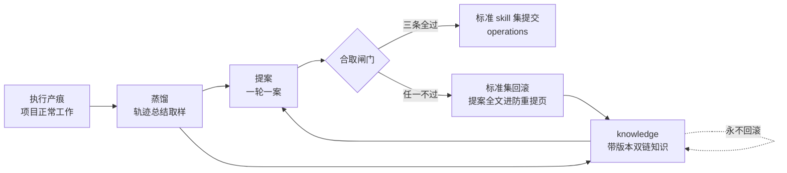

# distil-skill - evo-skills 项目技能自进化

**渐进知识库型 skill**:本文件只做意图路由与环速览,完整机制在 `references/` 五篇,按需定点读,不要求一次读完。

核心思想:**项目技能集是被治理的活资产**。执行经验先落带时间的历史轨迹总结(sources),蒸馏成带版本、双向链接的结构化知识(knowledge),一案提案过合取闸门才进标准 skill 集(operations);知识层永不回滚,标准层拒绝即回滚;证据不足走 no_action,不硬造产出。

## 一、意图路由

> 表未覆盖的意图:用文件名或关键字直搜 references/,或查 `references/README.md` 索引。

| 意图 / 你要做的事 | 参考 |
| --- | --- |
| 建或看三层聚合 / 轨迹总结与资格过滤 / 模式页与防重提页 / 双链与版本 | `references/layers.md` |
| 记执行轨迹 / 一天一篇活轨迹 / 坑与裁定留痕 / 升格分流 | `references/trajectories.md` |
| 跑一轮进化环 / 蒸馏取样与纪律 / 提案一案 schema / 停机条件 | `references/loop.md` |
| 给提案设闸验收 / 接受谓词 / 发布纪律 / 跨端转移 | `references/gate.md` |
| 双端执行面 / 项目级加载 / 隔离验证轮 / transcript 过滤 / 命令面 | `references/backends.md` |

## 二、四步环速览

- 三层单向支撑:sources 撑 knowledge,knowledge 撑标准 skill,反向不成立;原理不进标准页,步骤不进知识页
- 闸门合取三条:既有门禁无回归;至少一条点名失败义务翻转为过;标准页链到有 sources 的知识页
- 停机:无未覆盖的失败义务,或连续 no_action;没有满分短路

## 三、硬规则(速览)

- 标准面只收过闸产物;knowledge 可读但不进技能安装路径,蒸馏文本不是标准 skill
- 模式页无 trace 引文标 unverified,不得当提案依据;防重提页只由闸门追加,蒸馏角色只读
- 零工具调用、空输出的回合不进样本也不进分母;单次随机会话不得当分数
- 无人值守只批蒸馏与提案;接受停在待审提案,人不裁不发布
- 命令面以本机 `claude --help` 与 `codex exec --help` 实查为准,不照抄外部文档句子
