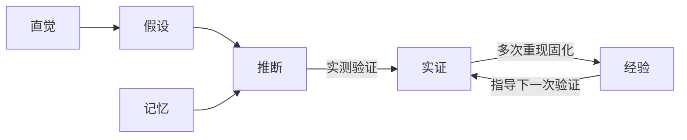

# 写作规范：命名三层标准、六态与门禁

> 写任何项目文档前过一遍本篇。核心目标：**定位内容不需要读全文**，目录名、文件名、结构化标题是同一套检索接口的三层，标准定好，`rg` 搜得到、`mq` 抽得出、定点读得准 [经验： 用户裁定 2026-09-03]。

## 一、定位模型（三层检索接口）

```text
目录名 → 定类别(rg 目录词)  →  文件名 → 定主题(rg 文件名词)  →  标题 → 定节(mq .h2)→ 定点读正文
```

| 层 | 职责 | 检索方式 | 命名要求 |
| --- | --- | --- | --- |
| 目录名 | 领域/类别词，全仓唯一语义 | `rg --files \| rg 目录词` | 小写英文单词或体系固定名（docs/proven/research/references/guide/mistakes;base/flow/env/tool/exp) |
| 文件名 | 主题词，同目录唯一 | `rg --files \| rg 主题词` | 编号或类别前缀 + `-` + 主题短词，不含空格/括号/冒号 |
| 标题 | 节级导航与抽取 | `reader query 文件 ".h2"` | h2 = 一节一事，节名即主题词，可独立成目录 |

反模式：同名异义目录、文件名含修饰词堆砌（`最终版_v2 复件`）、h2 一节多事或节名无主题（`其它`、`杂项`），任何一层失准，检索链就断。

## 二、文件名标准

- **文件名即标题**：文件名 = 文档主题，打开前就知道内容
- skill 参考目录（本库）：类别前缀 + 主题词，`base-init` / `flow-release` / `env-platform` / `tool-gh` / `exp-pitfalls`
- 项目 docs 目录：编号开头，`PNNNN-短名.md`（proven）、`SNNN-标题.md`（research）、`RNNN/GNNN-<类别>细则-<主题>.md`（references/guide）、`M1xx-<错误族>.md`（mistakes)
- 博客式长标题（research/diary）：用 `-` 断句
  - 正例：`S004-Word文档读取选型-docx自解与doc直读双路线实测.md`
  - 反例：`S004-Word读取选型(双路线).md`、`S004 Word选型:双路线.md`、`S004-最终版2.md`
- 一律不含：空格、括号、冒号、版本修饰词（版本进 CHANGELOG，不进文件名）

## 三、标题结构标准（面向 mq 提取）

结构化不是排版装饰，是**给 mq 提取的接口**：`reader query <文件> ".h2"` 抽节导航、`".code"` 抽命令、`".link"` 抽链接，结构不规范，机器抽不出来。

- 树形分层：**h1 = 文档主题（与文件名对齐）；h2 = 可独立提取的节**（一节一事，节名即主题词）；h3 以下为节内细分
- 标题干净：**不带括号、口号、破折号、版本号**；解释放标题下一行 `>` 引用
  - 正例：`## 一、命名三层标准` + 下一行 `> ...`
  - 反例：`## 一、命名标准(2026 最新版,重要)!`
- **命令一律进代码块**（mq `.code` 整块可抽）；关键事实用**表格**承装（键值结构，机器可切列）；列表 `-` 平铺
- 每篇文档头部 `>` 引用块写清**角色定位与分工**（「本文件 = X；与 Y 的分工是…」）

自检：`reader query <本文件> ".h2"` 的输出应当就是本文的可导航目录；抽不出、或抽出无主题词的节名，即结构不合格。

## 四、六态标记（事实核查状态，知行合一的工程化）

> 六态是知行合一在知识管理上的工程化：**实证态是知行合一态**（真知必已在行，「不行不足谓之知」《传习录》）；**其余五态是中转态**，存在目的不是长期栖身，是判断**如何进入实证**；实证与经验互为循环，迭代复利 [经验： 用户裁定 2026-09-04]。

研究与方案文档的**事实性断言**（非纯描述/指令）必须标六态之一；不标即视为未完成：

| 标记 | 含义 | 示例 |
|------|------|------|
| `[实证: ...]` | 已在本仓/本机实际验证 | `[实证: 2026-08-29 poc-endpoint 退出 0]` |
| `[推断: ...]` | 由现象或逻辑推出，未直接验证 | `[推断: Linux 同套 SDK 路径]` |
| `[经验: ...]` | 来自历史惯例，非本次实测 | `[经验: win-rmux 2026-08-21]` |
| `[记忆: ...]` | 记忆性陈述，建议复核 | `[记忆: 首版日期]` |
| `[假设: ...]` | 待验证的猜想 | `[假设: 升级后仍兼容]` |
| `[直觉: ...]` | 主观倾向，非依据 | `[直觉: 这样更稳]` |

两级结构与循环：



- **实证态（一）**：知行合一态，真知必已在行
- **中转态（五）**：为进入实证服务，标注即回答「如何进入实证」：`[经验]` 择机复现即升（与实证循环复利，见 exp-sedimentation.md）；`[推断]` 附验证动作；`[记忆]` 附复核点；`[假设]` 必带验证路径；`[直觉]` 只能导向调研，不能导向结论

用法（红线级）：
- 断言句尾加 `[实证: <依据>]`；标记与正文同段，方括号
- 纯描述、命令、引用行（`>`）可不标；**关键结论处必须带标记**
- **中转态标注义务**：`[假设]`/`[推断]` 写清验证动作，`[记忆]` 写清复核点；不写即未完成
- **收尾处置纪律**：目标收尾/归档时，悬空中转态必须处置：升实证、留 research 待验、或注销；禁止长期滞留（「终身不行，亦遂终身不知」《传习录》：悬空假设永远停在假设）
- **禁止把「没验证」写成「已验证」（实证滥用）；禁止用猜测冒充结论**

## 五、语言与字符硬禁令

中文为主；命令、代码、专有名词保原文。目标：无 AI 写作痕迹、可机械校验。分级：四类禁字为 error 级（`scripts/scan.py` 与 `check.py` 的 PE-12 同源机检，规则唯一权威 `scripts/mdrules.py`）；空格混排为排版偏好不做 error。

### 四类禁字（error 级）

| 类 | 禁 | 替代写法 |
| --- | --- | --- |
| 破折号与连接号 | `—` `——` `–` `―` `−` `ー` | 补充说明用冒号、括号或拆句；范围中文「3 至 5」、英文 `3-5`；半角连字符合法 |
| Unicode 箭头 | `→` `⇒` `←` `↔` `➜` 等 U+2190 至 U+21FF 与装饰箭头 | 流程用有序列表或「到」；映射写「对应」；转换写「转换为」；`->` `=>` 与 mermaid `-->` 仅限代码内 |
| emoji 与装饰符 | U+1F000 至 U+1FAFF、U+2600 至 U+27BF、变体选择符 | 提示用 GFM 警示块或加粗；表格勾选用「是 / 否」文字；字形文档化时放行内代码 |
| 智能引号与全角字母数字 | `“ ” ‘ ’`、全角字母数字、全角空格 | 中文引号直角 `「」『』`；代码与行内代码内一律半角 |

### 豁免区（校验先剔除再扫）

围栏代码块（含 mermaid）、行内代码、链接与图片目标、裸 URL、规则定义区（黑名单与违规示例）、第三方引文原文。

### 空格与混排（排版级，不做 error）

中文与英文数字间加一个半角空格（32 GB、100 ms；度与百分比除外）；全角标点与邻字不加空格；不重复标点；中文句全角、英文整句内部半角；表格对齐只用半角空格。

### 智能体输出自检四步

逐段回查四类禁字；确认命中均属豁免区；豁免区外逐个替换；替换后重读确认语义无损。

> 文档路径写法全仓统一一种并在 G001 声明：Windows 主开发仓用反斜杠（`docs\proven\`），跨平台协作仓用正斜杠（`docs/proven/`）；同仓不混用（详见 env-platform.md）

## 六、门禁选配（按项目落地）

| 门禁 | 形态 | 建议 |
| --- | --- | --- |
| markdown lint | rumdl（`.rumdl.toml`）或 markdownlint | 文档仓强烈建议；存量告警清零后门禁 |
| 断链扫描 | `.tools\md-ref-scan.py`(reader 仓 模式：仓内相对引用递归检查 + 豁免清单） | 文档结构大改后必跑 |
| 禁用字符机检 | `.tools\md-char-scan.py` | guide 定了禁用清单就配机检，豁免区显式登记 |
| 标题规范机检 | `.tools\md-heading-scan.py` | 可选（标题括号/主题词缺失） |

门禁原则：**规则先写进 guide，机检只是执行**；机检不过 = 文档未完成；豁免必须显式登记，不留口头豁免。

## 七、写完自查

1. 三层命名各就位：目录类别词准确、文件名即主题（编号/前缀正确）、已登记 INDEX
2. 头部有角色定位 `>` 引用；标题成树，`.h2` 自检可导航
3. 事实性断言标六态，关键结论有标记；中转态（假设/推断/记忆）带进入实证的路径，收尾无滞留
4. 仓内引用相对路径可达（断链扫描过）
5. 动作触发的文档义务已对齐（见 base-primitives.md 文档义务表）
6. 吸收即提炼：新增内容已剔除信源冗余，只留最准确精练的可复用表达，自省可再删
